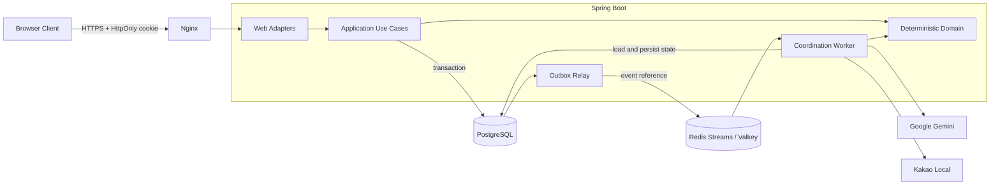

# meet-me-server

[](https://github.com/meet-me-duo/meet-me-server/actions/workflows/ci.yml)

> 조건은 자연어로, 후보 계산은 결정론적으로.

여러 사람의 시간과 장소 조건을 모아 **Plan A/B/C 일정 후보를 제안하는 AI 기반 일정 조율 서비스**의
백엔드입니다. Gemini는 사용자의 비정형 문장을 구조화하는 역할만 맡고, 시간 교집합·장소 허용 영역·후보
순위와 최종 상태 전이는 서버의 결정론적 도메인 로직이 담당합니다.

이 저장소는 Wanted AI Champion 제출 MVP를 위해 구현한 백엔드, AWS 인프라와 CI/CD를 포함합니다.
프론트엔드는 별도 프로젝트에서 개발합니다.

- **API 문서**
  - [운영 Swagger UI](https://api.meet-me.co.kr/swagger-ui/index.html)
  - [OpenAPI JSON](https://api.meet-me.co.kr/v3/api-docs)
- **제품 요구사항:** [PRD](docs/PRD.md)
- **기술 구조:** [Architecture](docs/ARCHITECTURE.md)
- **주요 결정:** [ADR](docs/ADR.md)

> 운영 URL은 2026-09-20 배포 기준입니다. API 계약은 실행 중인 OpenAPI 문서를 최우선으로 봅니다.

## 제품이 해결하는 문제

기존 일정 조율 도구는 참여자가 시간표를 반복해서 채워야 하고, 복합적인 시간·장소 조건을 표현하기
어렵습니다. meet-me는 다음 흐름으로 입력 부담과 조율 과정의 사회적 마찰을 줄입니다.

1. 주최자가 로그인 없이 방을 만들고 참여 링크를 공유합니다.
2. 참여자는 자연어 또는 방 전용 가능 시간 격자로 조건을 제출합니다.
3. 후보 생성 전까지 다른 참여자의 조건은 공개하지 않습니다.
4. 입력이 마감되면 Gemini가 자연어만 구조화하고 Kakao Local이 특정 가능한 장소만 정규화합니다.
5. 서버가 시간·장소 조건을 계산하여 Plan A/B/C를 종류별 최대 한 장으로 제안합니다.
6. 주최자가 하나를 확정하면 모든 참여자가 같은 결과를 조회합니다.

| 후보 | 의미 |
| --- | --- |
| **Plan A** | 전원이 참석 가능한 시간과 오프라인 장소 조건을 모두 만족하는 최적안 |
| **Plan B** | 전원이 참석 가능한 온라인 대안 |
| **Plan C** | 전원 교집합이 없을 때 최소 2명을 유지하는 최대 참석자 차선안 |

AI가 최종 후보를 선택하지 않습니다. 동일한 구조화 입력은 항상 동일한 후보를 만들며, 동률도 공통 가능
총시간·가장 이른 시작·안정적인 내부 식별자 순으로 해소합니다.

## 백엔드 설계 하이라이트

### 1. AI와 핵심 의사결정의 경계

- Gemini Structured Output을 닫힌 조건 유니온으로 제한하고 공급자 응답을 서버에서 다시 검증합니다.
- LLM이 만든 좌표, 후보 점수와 최종 선택은 신뢰하지 않습니다.
- Kakao Local 검색은 전체 결과에서 정규화된 장소명이 정확히 한 건 일치할 때만 채택합니다.
- 시간 교집합, 거리·허용 영역과 Plan A/B/C 계산은 프레임워크 독립적인 Domain에서 수행합니다.
- 구조화 성공 후 일부 의미 조건만 반영할 수 없으면 `PARTIAL`, 공급자 기술 장애가 지속되면 입력을 보존한
  `ANALYSIS_DELAYED`로 분리합니다.

### 2. 유실과 중복 전달을 견디는 비동기 파이프라인

참여자의 제출 요청에서 외부 AI를 호출하지 않습니다. 원본 제출은 불변 버전으로 먼저 저장하고, 입력 수집
종료 시점의 최신 버전만 하나의 방 전체 배치로 고정합니다.

- PostgreSQL 트랜잭션 안에서 조율 작업과 Outbox를 함께 기록합니다.
- Relay가 작업 참조만 Redis Streams로 발행하고 Worker가 PostgreSQL에서 원문을 조회합니다.
- PostgreSQL의 처리 lease와 상태를 기준으로 중복 실행을 막습니다.
- Redis Pending 또는 데이터 유실 뒤에도 PostgreSQL에서 작업을 재발행할 수 있습니다.
- 첫 전달을 포함해 5회 실패한 poison message는 PostgreSQL에 먼저 영구 실패를 기록한 뒤 참조형 DLQ로
  이동합니다.

Redis는 전달과 호출 제한을 담당하지만 영구 비즈니스 데이터의 최종 기준은 PostgreSQL입니다.

### 3. 로그인 없는 MVP의 권한 모델

- 서버가 256비트 불투명 guest credential을 다음 속성의 cookie로 발급합니다.
  `Secure HttpOnly; SameSite=Lax; Path=/api`
- 원문 credential은 응답 body나 브라우저 저장소에 노출하지 않고 PostgreSQL에는 SHA-256 digest만 저장합니다.
- 방을 만든 세션만 `HOST` 권한으로 마감·재분석·후보 확정을 수행합니다.
- 공유 초대 코드는 방 접근 수단일 뿐 참여자 또는 주최자 권한이 아닙니다.
- 상태 변경 요청은 정확한 허용 Origin을 검증하고 Redis 기반 호출 제한을 적용합니다.
- 로그에는 원본 자연어·cookie·좌표·외부 API key를 기록하지 않습니다.

### 4. Aggregate 우선 헥사고날 아키텍처

```text
com.meetme.server
├── meetingroom/{domain,application,adapter}
├── participant/{domain,application,adapter}
├── submission/{domain,application,adapter}
├── coordination/{domain,application,adapter}
├── shared
└── config
```

각 Aggregate가 자신의 Domain, Use Case, Port와 Adapter를 함께 소유합니다. 의존 방향은
`adapter → application → domain`이며 Domain은 Spring, Komapper, Redis와 외부 SDK를 알지 못합니다.
Web DTO, 외부 공급자 DTO, Domain 모델과 Komapper 영속 Record도 분리합니다.

## 시스템 구조



## 기술 스택

- **Language:** Kotlin 2.3.21, Java 17
  - null 안전성과 명확한 도메인 모델, 안정적인 JVM 생태계
- **Framework:** Spring Boot 4.1.1, Spring MVC, Validation
  - 동기 JDBC 기반 유스케이스와 HTTP 경계 구성
- **Persistence:** PostgreSQL 18, Komapper JDBC 7.0.0, Flyway
  - SQL 제약·트랜잭션 중심 데이터 정합성과 명시적인 스키마 이력
- **Async / Rate limit:** Redis Streams, ElastiCache Serverless for Valkey
  - 비동기 전달, Pending 복구, DLQ와 공개 API 호출 제한
- **AI / Place:** Gemini 3.8 Flash, Google GenAI SDK, Kakao Local API
  - 자연어 조건 구조화와 보수적인 국내 장소 정규화
- **API:** springdoc-openapi, RFC 9457 Problem Details
  - 실행 코드에서 생성되는 프론트엔드 계약과 언어 중립 오류 코드
- **Test:** JUnit 5, Spring Boot Test, Testcontainers
  - 순수 Domain부터 실제 PostgreSQL·Redis 통합 경계까지 검증
- **Observability:** Actuator, Micrometer Prometheus, JSON logs
  - health·지표와 상관관계 ID 기반 운영 진단
- **Infrastructure:** Docker, Nginx, Terraform, AWS
  - 재현 가능한 이미지·인프라와 관리형 영구 데이터 서비스
- **CI/CD:** GitHub Actions, AWS OIDC, ECR, SSM
  - 장기 AWS Access Key 없이 main CI 성공 commit을 자동 배포

## 운영 배포

제출 MVP는 비용과 구현 복잡도를 고려해 서울 리전의 단일 EC2에서 Nginx와 Spring Boot 컨테이너를
실행합니다. 영구 데이터와 작업 전달 계층은 호스트 수명주기에서 분리했습니다.

- **Compute:** EC2 `t4g.small`, ARM64 애플리케이션 이미지
- **Data:** RDS PostgreSQL 18 `db.t4g.micro`, Single-AZ, 7일 자동 백업
- **Stream / Cache:** ElastiCache Serverless for Valkey
- **Edge:** Route 53, ACM exportable certificate, Nginx TLS reverse proxy
- **Artifact / Deploy:** ECR image digest, S3 release contract, Systems Manager
- **Secrets:** RDS managed secret와 SSM Parameter Store `SecureString`
- **IaC state:** versioning·암호화를 적용한 S3 backend와 native lock file

배포는 다음 순서를 따릅니다.

```text
main merge
  → CI: ktlintCheck + assemble + test + 운영 구성 회귀 검사
  → CI 성공 commit의 SHA로 ARM64 image build·ECR push
  → 같은 image로 Flyway migration 선실행
  → SSM을 통한 EC2 application 교체
  → app·Nginx health 및 공개 /healthz·/v3/api-docs 검증
```

GitHub Actions는 OIDC로 AWS 임시 자격 증명을 발급받습니다. 배포는 tag가 아닌 image digest를 고정하며,
실패하면 이전 digest로 애플리케이션을 되돌립니다. Flyway migration은 자동 downgrade하지 않으므로 운영
스키마는 이전 애플리케이션과 호환되는 단계적 변경을 우선합니다.

## 테스트와 검증 전략

- **Domain:** 시간대/DST, 연속 시간 교집합, 장소 허용 영역, Plan A/B/C와 동률 규칙
- **Application:** 트랜잭션 경계, 최신 제출 고정, 중복 종료·확정의 멱등성과 권한 분기
- **Persistence:** H2 대신 Testcontainers PostgreSQL에서 Flyway fresh/upgrade와
  실제 제약 검증
- **Async:** 중복 Stream 전달, 처리 lease, Pending 회수, 재발행과 poison DLQ 순서
- **External adapters:** Gemini schema·응답 상한·재시도와 Kakao 다중 페이지·동명 장소·timeout 계약
- **Web / Security:** cookie 속성, Origin, 타인 입력 비공개,
  401/403/409/429/503과 OpenAPI 계약
- **Architecture:** 소스 경로와 package 일치, Domain 프레임워크 독립성과 역방향 의존 방지
- **Deployment:** ARM64 image, raw secret 전달, 비루트·read-only 컨테이너와
  실제 Nginx 기동 회귀 검사

핵심 동시성·보안·외부 Adapter 테스트는 정상 사례만 확인하지 않고 의도적인 결함을 주입해 기존 테스트가
이를 탐지하는지도 검증합니다.

## API

공개 MVP API는 방 생명주기, 참여, 조건 제출·복원, 분석 재요청, 후보 조회·확정과 결과 조회를 제공합니다.
필드·enum·nullable 여부와 오류 응답은 README에 복제하지 않고 실행 코드에서 생성되는 Swagger/OpenAPI를
계약으로 사용합니다.

| 환경 | Swagger UI | OpenAPI JSON |
| --- | --- | --- |
| Local | [localhost:8080/swagger-ui](http://localhost:8080/swagger-ui/index.html) | [localhost:8080/v3/api-docs](http://localhost:8080/v3/api-docs) |
| Production | [api.meet-me.co.kr/swagger-ui](https://api.meet-me.co.kr/swagger-ui/index.html) | [api.meet-me.co.kr/v3/api-docs](https://api.meet-me.co.kr/v3/api-docs) |

프론트엔드 구현 시 cookie, Polling, 공개 상태와 오류 처리 규칙은
[Frontend Handoff](docs/FRONTEND_HANDOFF.md)를 함께 참고합니다.

## 로컬 실행

### 요구 환경

- Java 17+
- Docker와 Docker Compose
- 저장소에 포함된 Gradle Wrapper

### 1. PostgreSQL과 Redis 실행

```shell
docker compose up -d postgres redis
```

### 2. 선택적인 외부 연동 설정

애플리케이션은 외부 key 없이도 기동하고 정형 시간 입력 흐름을 실행할 수 있습니다. 자연어 분석과 장소
정규화까지 확인하려면 `.env.example`을 참고해 실행 프로세스에 다음 환경 변수를 주입합니다.

```properties
GEMINI_API_KEY=
KAKAO_LOCAL_API_KEY=
```

실제 값은 Git, 채팅, Issue, PR과 로그에 남기지 않습니다. 로컬 보관이 필요하면 Git에서 제외된
`.env.local`을 사용하고 IDE Run Configuration 또는 현재 terminal session에서 애플리케이션 프로세스에
전달합니다.

### 3. 애플리케이션 실행

```shell
./gradlew bootRun --args='--spring.profiles.active=local'
```

Windows PowerShell에서는 다음 명령을 사용합니다.

```powershell
.\gradlew.bat bootRun --args="--spring.profiles.active=local"
```

로컬 API는 `http://localhost:8080`, Prometheus 지표는 `http://localhost:8080/actuator/prometheus`에서
확인할 수 있습니다.

## 검증

```shell
./gradlew --no-daemon ktlintCheck assemble test
```

Windows PowerShell:

```powershell
.\gradlew.bat --no-daemon ktlintCheck assemble test
```

## 구현 범위와 다음 단계

### 제출 MVP에 포함

- 로그인 없는 방 생성·참여와 브라우저 세션 기반 HOST 권한
- 자연어·수동 가능 시간 제출과 최신 입력 복원
- 비동기 Gemini 구조화와 Kakao 장소 정규화
- 결정론적 Plan A/B/C·`NO_MATCH`·`PARTIAL` 계산
- 분석 지연 재요청, 후보 확정과 결과 공유
- Redis 호출 제한, 30일 데이터 정리와 Prometheus·JSON 로그
- Terraform AWS 인프라와 main 기반 자동 CI/CD

### Post-MVP 또는 운영 준비 과제

- Google·Kakao 로그인과 Google Calendar 연결·방별 ON/OFF
- Grafana Cloud 중앙 로그·지표·대시보드와 자동 알림
- 합의된 성능 목표 기반 부하 테스트
- 이전 image digest rollback과 RDS 시점 복구 리허설
- 다중 인스턴스·무중단 배포 요구 발생 시 ECS·ALB 재평가

현재 상태와 완료 근거는 [Implementation Plan](implementation_plan.md), 사용자 개입이 필요한 외부 설정은
[User Intervention Guide](docs/USER_INTERVENTION.md)에서 추적합니다.
