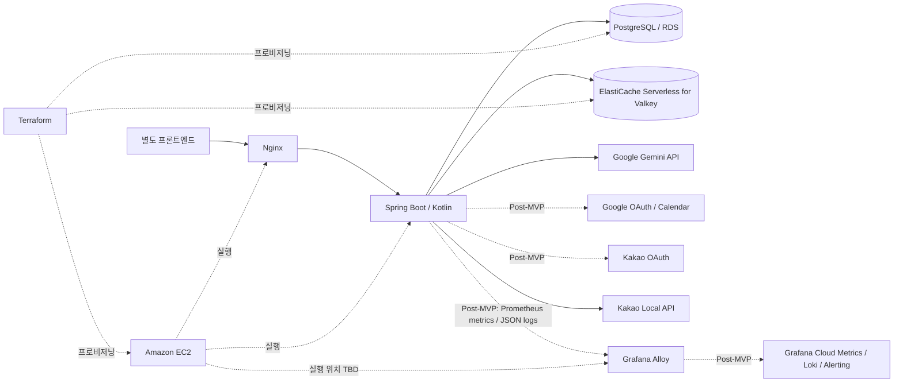

# Architecture: meet-me-server

> **문서 상태:** Draft  
> **대상 시스템:** AI 기반 스마트 일정 조율 서비스의 백엔드  
> **저장소:** `meet-me-duo/meet-me-server`  
> **관련 문서:** `docs/PRD.md`, `docs/ADR.md`

## 1. 목적과 범위

이 문서는 `meet-me-server`의 기술적 구조, 컴포넌트 책임, 의존성 방향과 외부 시스템 경계를 정의한다. 이 저장소는 백엔드만 포함하며 프론트엔드는 별도 저장소에서 개발한다.

현재 확정되지 않은 선택은 임의로 확정하지 않고 **TBD**로 표시한다. 확정된 결정 중 향후 구현에 큰 영향을 주는 내용은 `docs/ADR.md`에도 기록한다.

## 2. 기술 스택 요약

| 영역 | 선택 | 상태 |
| --- | --- | --- |
| 언어 | Kotlin 2.3.21 | 확정 |
| JVM | Java 17 | 확정 |
| 빌드 | Gradle 9.7.1 Wrapper, Kotlin DSL | 확정 |
| 애플리케이션 프레임워크 | Spring Boot 4.1.1 | 확정 |
| 애플리케이션 구조 | 단일 모듈, 패키지 기반 헥사고날 아키텍처 | 확정 |
| 주 데이터베이스 | PostgreSQL | 확정 |
| 데이터 접근 | Komapper JDBC | 확정, 구체 의존성 버전은 구현 시 고정 |
| DB 스키마 마이그레이션 | Flyway | 확정 |
| 로컬·테스트 데이터베이스 | Docker Compose PostgreSQL, Testcontainers PostgreSQL | 확정, H2 미사용 |
| 인메모리 데이터 저장소 | Redis 호환 ElastiCache Serverless for Valkey | 제출 MVP의 Streams·호출 제한·DLQ 운영 배치 확정, Post-MVP Refresh Token TTL·백업 정책 TBD |
| 리버스 프록시 | EC2의 Nginx | TLS 종료, API 라우팅, 요청 제한과 헬스체크 담당 |
| 사용자 접근 | 제출 MVP는 전원 익명 브라우저 세션, Post-MVP는 주최자 Google·Kakao 로그인 | 제출 MVP 주최자 권한은 방 생성 세션에 귀속. RS256 Access/Refresh와 OAuth는 Post-MVP |
| 자연어 파싱 | `gemini-3.8-flash` Structured Output, Google GenAI Java SDK 1.72.0 | 고정 stable ID, 조건 유니온과 256KiB 응답 상한 |
| 운영 데이터베이스 | Amazon RDS for PostgreSQL | 확정 |
| Infrastructure as Code | Terraform | 확정 |
| 운영 컴퓨팅 | Amazon EC2 `t4g.small` | 제출 MVP 단일 인스턴스, ECS 전환 가능성을 컨테이너 경계로 보존 |
| 이미지 레지스트리 | Amazon ECR | 이미지 digest 기반 배포 |
| 지도·좌표 공급자 | Kakao Local API | 장소 검색·정규화와 표시 이름만 외부 위임, 거리·영역 계산은 서버 담당 |
| API 계약 문서 | Swagger/OpenAPI, springdoc-openapi 3.1.0 | 확정 |
| 시간대 | IANA Zone ID, MVP `Asia/Seoul` | 저장·계산 경계 확정, 사용자 선택은 MVP 이후 |
| 국제화 | Spring MessageSource, BCP 47 locale, MVP `ko-KR` | 기반 도입 확정, 추가 언어 TBD |
| 관측성 | 제출 MVP는 Spring Boot Actuator·Micrometer Prometheus 지표와 JSON 표준 출력, Grafana Alloy·Cloud Metrics·Loki·Alerting은 Post-MVP | MVP 로컬 기반 확정, 외부 전송은 후속 범위 |

## 3. 시스템 컨텍스트



### 외부 경계

- **프론트엔드:** 제출 MVP에서는 로그인 없이 방 생성·참여, 선택적 자연어·방 전용 가능 시간 입력, 본인 최신 입력 복원, 비동기 분석 상태와 플랜 확정 UI를 담당한다. Post-MVP에는 주최자 로그인, Google Calendar 연결과 방별 ON/OFF UI를 추가한다. 별도 장소 입력란이나 지도 기반 좌표 수집은 제공하지 않는다.
- **Google/Kakao:** Post-MVP에 meet-me 사용자 인증을 제공한다. Google Calendar 연동은 meet-me 인증을 완료한 사용자에게만 제공하며 Google의 별도 Calendar 동의 범위가 필요하다.
- **Google Gemini:** 자연어 조건 구조화와 시간표 이미지 분석만 담당한다.
- **Kakao Local API:** 자연어에서 추출된 국내 장소 표현을 키워드로 검색·정규화하고 결과 표시용 이름을 제공한다. 거리와 영역 계산, 검색 결과 고유성 판정과 후보 순위는 서버가 담당한다.
- **AWS:** 애플리케이션 런타임과 운영 PostgreSQL을 제공한다.
- **Grafana Cloud (Post-MVP):** Alloy가 전송한 애플리케이션·Worker 지표와 로그를 관리형 Metrics 및 Loki에 저장하고 Grafana-managed Alerting으로 운영 알림을 평가한다. 제출 MVP는 계정·전송 자격 증명 없이 애플리케이션의 Prometheus endpoint와 JSON 표준 출력까지만 제공한다.

### 제출 MVP 접근 모드

- Wanted AI Champion 심사·투표용 배포는 소셜 로그인 없이 공개한다.
- 서버는 첫 방 생성 또는 참여 시 32바이트 암호학적 난수로 익명 브라우저 자격 증명을 발급한다. 원문은 API 호스트 전용 `Secure HttpOnly; SameSite=Lax; Path=/api` 쿠키로만 전달하고 PostgreSQL에는 SHA-256 digest만 저장한다. 수명은 발급 시점부터 고정 30일이며 사용에 따라 연장하거나 자동 회전하지 않는다.
- 방 생성 세션은 첫 참여자와 `HOST` 역할을 함께 소유하며, 같은 세션만 마감·재분석·후보 확정 같은 주최자 명령을 수행한다.
- 공유 링크는 방 진입 수단일 뿐 참여자 또는 주최자 권한 증명이 아니다.
- 공유 링크와 공개 방 API는 내부 UUID 대신 128비트 난수를 base64url로 인코딩한 22자 초대 코드를 사용한다.
- Google·Kakao OAuth, 서비스 JWT/Refresh Token과 Google Calendar endpoint·adapter는 제출 MVP에서 활성화하지 않고 Post-MVP에 구현한다.
- 제출 기간 종료 후 인증 모드 전환은 자동 날짜 조건이 아니라 명시적인 배포 설정과 회귀 테스트를 거쳐 수행한다.

## 4. 헥사고날 아키텍처

### 의존성 원칙

의존성은 외부 어댑터에서 애플리케이션과 도메인 방향으로만 향한다. 핵심 일정 매칭 규칙은 Spring, Komapper, Redis, Gemini SDK, OAuth SDK, 지도 SDK에 직접 의존하지 않는다.

```text
Inbound Adapter
  -> Inbound Port / Use Case
    -> Domain
    -> Outbound Port
      <- Outbound Adapter
```

### 내부 영역

- **Domain:** 모임, 참여자, 일정 입력 모드, 자연어 시간 조건, Calendar 불가 시간, 실제 날짜형·주간 반복형 방 전용 가능 시간과 추가 불가 시간, 장소 조건, 일정 후보와 Plan A/B/C 계산 규칙을 표현한다. 모임 생성자는 항상 주최자 역할을 가진 첫 번째 참여자이며 예상 참여 인원에 포함된다. 예상 참여 인원은 설정 시 2명 이상이고, 후보 생성에는 최소 2명의 고유 참여자 제출이 필요하다.
- **Application:** 유스케이스를 조합하고 트랜잭션 및 처리 순서를 조정한다.
- **Inbound Ports:** 방 생성, 참여, 조건 제출·본인 최신 입력 조회, 지연된 방 분석 재요청, 매칭 실행, 최종 확정과 같은 시스템 진입점을 정의한다.
- **Outbound Ports:** 데이터 저장, 캐시, 자연어 파싱, OAuth, 캘린더 조회, 좌표 변환과 같은 외부 의존성을 추상화한다.

핵심 도메인은 다음 네 Aggregate 경계를 사용한다.

- `MeetingRoom`: 방 설정, 입력 수집 상태, 종료 정책·원인과 탐색 날짜 범위를 소유한다.
- `Participant`: 방별 참여와 `HOST`·`MEMBER` 역할 및 익명 브라우저 세션 소유권을 표현한다.
- `Submission`: 참여자별 제출 head와 최신 불변 제출 버전을 소유한다. 과거 버전은 PostgreSQL에 보존하되 Aggregate를 불필요하게 키우지 않는다.
- `CoordinationRun`: 마감 시 고정한 제출 배치, 조율 작업 상태, 후보 품질·목록과 최종 확정을 소유한다.

Aggregate 사이 불변식과 여러 저장소를 묶는 원자성은 Application 서비스와 PostgreSQL 제약으로 조정한다. 한 방의 참여자·제출 전체를 `MeetingRoom` 안에 적재하지 않아 동시 제출 시 거대한 Aggregate 경합을 피한다. 소셜 `User`와 공급자 계정은 제출 MVP Aggregate에 포함하지 않고 Post-MVP 경계로 유지한다.

### 어댑터 영역

- **Web Adapter:** HTTP 요청 검증, 인증 주체 해석, DTO 변환과 응답 직렬화를 담당한다.
- **Persistence Adapter:** Komapper JDBC로 PostgreSQL에 접근하고 영속 `Record`와 도메인 모델 간 변환을 담당한다.
- **Redis Adapter:** Redis Streams 기반 비동기 작업 전달을 구현한다. 인증 상태·캐시 등 추가 책임은 확정된 범위에만 구현한다.
- **AI Adapter:** Gemini 요청·응답과 도메인에서 사용하는 구조화 결과 사이를 변환한다.
- **OAuth Adapter (Post-MVP):** Google·Kakao 로그인 공급자별 차이를 내부 인증 포트 뒤로 숨긴다.
- **Calendar Adapter (Post-MVP):** Google Calendar 이벤트를 절대 불가 시간으로 변환한다.
- **Geo Adapter:** 추출된 장소 표현을 지도 공급자로 검색하고 하나의 위치로 특정 가능한 경우에만 공급자 응답을 도메인의 정규화된 장소 값으로 변환한다.

### 모듈 구성 원칙

- 도메인 모델에는 프레임워크 애너테이션과 외부 SDK 타입을 노출하지 않는다.
- 도메인 Aggregate·Entity·Value Object, Web DTO, 외부 공급자 DTO와 Komapper 영속 `Record`를 분리한다.
- Komapper 애너테이션과 KSP 매핑 정의는 `adapter.output.persistence` 내부의 `Record`와 별도 매핑 정의에만 둔다. 도메인 모델에는 Komapper 타입이나 애너테이션을 노출하지 않는다.
- 영속 타입은 DDD Entity와 혼동하지 않도록 `Entity` 대신 `Record` 또는 `Row` 접미사를 사용하고, 명시적인 Mapper로 도메인 모델과 변환한다.
- 포트는 실제 교체 가능성이나 테스트 경계가 있는 외부 의존성에만 둔다.
- 방 생성 유스케이스는 모임과 주최자 역할의 첫 참여자 생성을 하나의 트랜잭션으로 처리한다. 주최자도 조건 제출 상태를 가지며 예상 참여 인원 계산에서 제외하지 않는다.
- MVP는 단일 Gradle 모듈에서 `meetingroom`, `participant`, `submission`, `coordination` Aggregate를 최상위 기능 패키지로 두고, 각 패키지 아래에 `domain`, `application`, `adapter` 헥사고날 경계를 둔다. 전역 `domain`, `application`, `adapter` 최상위 패키지는 사용하지 않는다.
- 각 Aggregate의 `application.port.input`은 시스템 진입 유스케이스를, `application.port.output`은 실제 외부 교체 또는 독립 테스트 가치가 있는 의존성을 정의한다. Aggregate를 조정하는 유스케이스는 주된 상태 변경을 소유하는 Aggregate의 Application 계층에 둔다.
- 각 Aggregate의 `adapter.input.web`은 HTTP 진입점을, `adapter.output.persistence`와 `adapter.output.integration`은 영속성과 외부 서비스 연동을 구현한다. 여러 Aggregate에서 사용하는 ID·시간 값, 기술 중립 생성기 계약과 공통 HTTP 오류·게스트 쿠키 같은 횡단 기술 계약만 `shared`에 두며 Aggregate별 저장소·Record·Mapper는 `shared`로 올리지 않는다.
- 소스 경로와 package 선언의 일치, 네 Aggregate별 세 계층의 존재, Domain의 프레임워크 독립성과 Domain·Application의 Adapter 비의존은 아키텍처 테스트로 검증한다.
- 규모와 독립 배포 필요성이 확인되기 전에는 멀티 모듈로 분리하지 않는다.

## 5. API 계약과 Swagger

Swagger/OpenAPI 문서를 별도 프론트엔드 저장소가 사용하는 공식 API 계약으로 취급한다.

- 모든 공개 Controller 엔드포인트에 `@ApiResponse`를 추가한다.
- 각 엔드포인트가 실제로 반환하는 성공 및 주요 오류 응답을 문서화한다.
- 요청·응답 DTO와 공개 필드에는 `@Schema`를 추가하여 의미와 제약을 설명한다.
- 도메인 모델과 영속성 Entity는 API 스키마로 직접 노출하지 않는다.
- API 변경 시 구현, OpenAPI 문서와 계약 검증 테스트를 함께 갱신한다.
- API의 상태와 오류 코드는 locale에 관계없이 안정적으로 유지한다. 서버가 제공하는 사용자 노출 메시지는 `Accept-Language`를 BCP 47 locale로 해석해 MessageSource에서 조회하며 MVP는 `ko-KR`로 fallback한다.
- 후보 조회 응답은 계산의 기준인 언어 중립 구조화 시간 후보와 표시용 자연어 요약을 함께 제공한다. 자연어 요약은 응답 시 구조화 결과에서 MessageSource 템플릿으로 생성하며 LLM 출력이나 영속 데이터의 기준으로 사용하지 않는다.
- 인증된 참여자는 `GET /api/rooms/{inviteCode}/candidates`로 확정 전 후보를 조회한다. `PARTIAL`의 참여자 표시 이름·실패 원문·미반영 사유는 별도 HOST 전용 `GET /api/rooms/{inviteCode}/candidates/unapplied-inputs`에서만 제공한다. 방 응답은 제출 전 고지를 위한 `input_disclosure_policy=HOST_ON_PARTIAL_RESULT`를 포함한다.
- HOST는 `POST /api/rooms/{inviteCode}/candidates/{candidateId}/confirmation`으로 후보를 확정하고, 참여자는 `GET /api/rooms/{inviteCode}/result`로 확정 결과를 조회한다. 같은 후보의 재요청은 멱등하게 성공하고 다른 후보의 중복·동시 요청은 `409`로 거부한다.
- 절대 시각은 ISO 8601 offset을 포함해 직렬화하고 방 응답에는 IANA Time Zone ID를 별도 필드로 제공한다.
- 방 생성 요청의 `search_start_date`, `search_end_date`는 지역 날짜 쌍이며 둘 다 전달하거나 둘 다 생략해야 한다. 둘 다 생략하면 서버가 방 생성 시점의 `Asia/Seoul` 날짜를 시작일, 14일 뒤를 배타적 종료일로 확정한다.
- 명시된 탐색 범위는 양수이며 최대 31일이어야 한다. 이 검증은 Web DTO에만 의존하지 않고 방 생성 유스케이스와 도메인 값 객체에서도 보장한다.
- 방 조회 응답은 기본값 적용 여부와 무관하게 확정된 두 날짜를 항상 반환한다. OpenAPI `@Schema`에는 생략 시 오늘부터 14일이라는 기본값을 기재하여 프론트엔드가 생성 화면에 동일한 안내를 표시할 수 있게 한다.
- 방은 주최자가 날짜 범위를 직접 지정했는지를 나타내는 언어 중립적인 범위 출처도 보존하고 응답한다. 명시 범위이면 수동 격자는 실제 날짜형, 기본 범위이면 월~일 주간 반복형임을 OpenAPI 계약에 명시한다.
- 공개 방 API는 `POST /api/rooms`, `GET /api/rooms/{inviteCode}`, `POST /api/rooms/{inviteCode}/participants`, `POST /api/rooms/{inviteCode}/close`를 사용한다. 내부 방 UUID와 참여자 UUID는 URL이나 응답에 노출하지 않는다. 생성자는 `host_display_name`, 일반 참여자는 `display_name`을 공백 제거 후 1~50자로 제공한다.
- 수동 마감에서 자동 조건이 아직 충족되지 않았고 `confirm_early`가 거짓이면 `409 EARLY_CLOSE_CONFIRMATION_REQUIRED`와 현재 현황을 반환한다. 클라이언트가 같은 endpoint에 `confirm_early=true`로 다시 요청하면 서버가 조건을 다시 평가한 뒤 마감한다. 이미 닫힌 방에 대한 동일 주최자 요청은 현재 마감 결과를 반환한다.
- 오류 응답은 RFC 9457 `application/problem+json`을 사용하고 locale과 무관한 `code`, MessageSource로 만든 `detail`, 검증 오류의 `field_errors`를 확장한다. 검증 실패는 `400`, 세션 누락·만료·위조·회수는 `401`, 유효한 다른 세션의 주최자 명령은 `403`, 알 수 없는 초대 코드는 `404`, 상태 충돌과 조기 마감 재확인은 `409`를 사용한다.
- 입력 제출·조회·수정 API는 인증된 서비스 사용자 또는 비로그인 참여자의 게스트 자격 증명을 참여자 소유권으로 해석한다. 게스트 자격 증명은 암호학적으로 안전한 난수로 생성한 브라우저 단위 불투명 bearer 값이며 `Secure HttpOnly` 쿠키로만 전달한다. 하나의 게스트 브라우저 세션은 여러 방의 참여자 레코드와 연결할 수 있지만 `(guest_browser_session_id, room_id)` 조합은 유일해야 한다. 응답 JSON, URL과 JavaScript가 읽을 수 있는 브라우저 저장소에는 노출하지 않는다. 공유 초대 링크만으로는 제출 조회·수정 권한을 부여하지 않는다.
- 본인 최신 제출 조회 응답은 수동 슬롯 전용 또는 Calendar ON 제출에서 nullable인 `raw_text`, 일정 입력 모드, 해당 모드의 `manual_available_times` 또는 `calendar_blocked_times`·`additional_blocked_times`와 서버가 판정한 수정 가능 여부를 반환한다. `schedule_input_mode=CALENDAR`는 해당 방에서 Calendar 사용이 ON이라는 명시적 의사이며 별도 팝업 확인 필드는 두지 않는다. 주최자 권한은 타인의 정상 입력이나 `ANALYSIS_DELAYED` 상태의 원문 조회 권한을 포함하지 않는다.
- 공개 상태 계약은 최소한 분석 지연을 뜻하는 `ANALYSIS_DELAYED`를 구분해야 한다. 이 상태의 방 단위 재분석 요청은 인증된 주최자에게만 허용하고 같은 고정 배치에 대해 멱등하게 처리한다.
- 로그인과 Refresh 성공 응답은 15분 Access Token과 만료 정보를 response body로 반환하고, 회전된 Refresh Token은 response body나 JavaScript가 읽는 일반 응답 헤더가 아니라 `Set-Cookie` 헤더의 API 호스트 전용 `Secure HttpOnly; SameSite=Lax; Path=/api/auth` 쿠키로만 전달한다. `Domain`은 지정하지 않고 `Max-Age`는 미사용 14일과 토큰 패밀리 잔여 절대 수명 중 짧은 값으로 설정한다. 클라이언트는 Access Token을 이후 요청의 `Authorization: Bearer` 헤더에 넣고, Refresh 요청에서는 쿠키를 자동 전송한다. Refresh·로그아웃처럼 이 쿠키로 권한을 행사하는 상태 변경 요청은 정확한 프론트엔드 Origin 허용 목록을 통과해야 하며 누락되거나 일치하지 않는 `Origin`은 거부한다. CORS credential 허용도 같은 명시적 Origin 목록에만 적용하고 wildcard를 사용하지 않는다. 정확한 body 필드명은 API 구현 시 정한다.

Spring Boot에서 Swagger UI와 OpenAPI 명세는 `springdoc-openapi-starter-webmvc-ui` 3.1.0으로 생성한다.

## 6. 핵심 데이터 흐름

### 6.1 소셜 로그인

1. 주최자는 방 생성 전에 Google 또는 Kakao 인증 흐름을 완료한다.
2. 백엔드는 공급자가 발급한 인증 결과를 검증한다.
3. 공급자와 공급자 사용자 식별자를 기준으로 서비스 사용자를 조회하거나 생성한다.
4. 백엔드는 서비스 API 호출에 사용할 인증 수단을 발급한다.
5. 일반 참여자는 서비스 로그인 없이 공유 링크로 방에 참여할 수 있다. 유효한 게스트 브라우저 세션 쿠키가 없을 때만 서버가 새 불투명 자격 증명을 생성하여 `Secure HttpOnly` 쿠키로 전달하고, 이후 여러 방의 참여·본인 제출 조회·수정 요청에서 같은 세션을 검증한다.
6. 같은 게스트 브라우저 세션이 이미 참여한 방에 다시 접근하면 새 참여자를 만들지 않고 기존 참여자를 반환한다. 한 브라우저에서 같은 방의 여러 게스트를 구분하는 흐름은 제공하지 않는다.

meet-me 서비스는 15분 수명의 RS256 JWT Access Token과 암호학적으로 안전한 불투명 Refresh Token을 발급한다. JWT 헤더의 `kid`로 검증 공개키를 선택하고 현재 private key 하나만 서명에 사용한다. 교체 시 이전 public key는 이미 발급된 Access Token의 15분 수명과 허용 clock skew가 모두 지난 뒤 제거한다. Private key는 저장소·이미지·로그에 넣지 않고 환경별 비밀 저장소에서 주입하며 검증용 public key 집합과 분리한다. Access Token은 로그인·갱신 response body로 전달하고 프론트엔드는 영구 브라우저 저장소에 보관하지 않은 채 이후 요청의 `Authorization: Bearer` 헤더로 전송한다. 서버는 요청마다 Redis를 조회하지 않고 Access Token의 서명과 만료를 검증한다. Refresh Token은 `Set-Cookie`의 `Secure HttpOnly` 쿠키로만 전달하며 원문은 서버에 저장하지 않는다. 서버는 Refresh 해시, 사용자·토큰 패밀리 참조, 회전·폐기 상태를 Redis TTL로 관리한다.

Refresh Token은 마지막 정상 사용으로부터 14일 동안 유효하지만 토큰 패밀리의 절대 수명은 최초 로그인부터 30일이다. 갱신할 때 기존 Refresh Token을 폐기하고 새 값의 미사용 TTL을 14일로 시작하되 패밀리의 남은 절대 수명을 넘기지 않는다. 폐기된 토큰의 재사용이 감지되면 해당 토큰 패밀리를 폐기한다. Redis 장애 중에는 갱신이 실패하고 Redis 데이터 유실 시 기존 Refresh 세션은 무효화되어 재로그인이 필요하지만 영구 사용자·방 데이터는 유실되지 않는다. 운영 프론트엔드와 API는 같은 상위 사이트의 서브도메인에 배치한다. Refresh 쿠키는 `Secure`, `HttpOnly`, `SameSite=Lax`, `Path=/api/auth`를 사용하고 `Domain`을 생략해 API 호스트 전용으로 제한한다. 매 발급·회전의 `Max-Age`는 미사용 14일과 토큰 패밀리의 남은 절대 수명 중 짧은 값이다. Refresh·로그아웃 요청은 명시적 프론트엔드 Origin과 정확히 일치할 때만 허용하며 누락·불일치 Origin을 거부한다. 이 Post-MVP 소셜 로그인 경계에서는 별도 synchronizer 또는 double-submit CSRF token을 추가하지 않는다. 일반 로그아웃은 요청의 Refresh Token이 속한 현재 기기 패밀리만 Redis에서 폐기하고 Refresh 쿠키를 만료시킨다. 별도의 인증된 모든 기기 로그아웃은 사용자와 연결된 모든 Refresh Token 패밀리를 폐기하고 현재 쿠키도 만료시킨다. Redis에는 사용자별 활성 패밀리를 찾을 수 있는 인덱스를 두되 일반 API 요청의 Access Token 검증은 Redis를 조회하지 않는다. 따라서 두 로그아웃 이후에도 기존 Access Token은 최대 15분 동안 유효할 수 있다. 서비스 로그아웃은 Google·Kakao 계정 연결이나 Calendar grant를 폐기하지 않는다.

Google·Kakao가 발급한 공급자 Refresh Token은 meet-me 서비스 Refresh Token과 다른 비밀정보다. Calendar 재사용 등에 필요한 공급자 토큰은 Redis TTL에 두지 않고 PostgreSQL의 암호화된 grant로 영구 보관하며 암호화 키 관리와 공급자별 갱신·폐기 절차는 TBD다. 게스트 자격 증명은 로그인 토큰과 분리된 하나의 브라우저 세션으로 여러 방의 참여를 소유하며 cookie 수명·범위·Origin 방어는 ADR-036을 따른다. 공유 링크는 방 진입 수단일 뿐 제출 소유권 증명이 아니다. Google Calendar 동의는 meet-me 서비스 로그인과 별도의 권한이지만 인증된 서비스 사용자만 시작할 수 있다.

### 6.2 Google Calendar 불가 시간 수집 (Post-MVP)

1. 애플리케이션은 참여자가 meet-me에 로그인했는지 확인하고, 비로그인 게스트의 Calendar 연동 요청은 거부한다.
2. 인증된 사용자가 Google Calendar 연동에 필요한 동의 범위를 승인한다.
3. Calendar ON 제출 또는 수정 요청을 접수할 때 Calendar 어댑터가 합의된 조회 기간의 일정을 가져온다. 화면 미리보기 등 그 이전 조회 결과는 매칭의 기준 스냅샷이 아니다.
4. 어댑터는 Google Calendar 응답을 서버 내부의 `calendar_blocked_times` 형식으로 변환하고 조회 완료 시각과 함께 해당 불변 제출 버전에 스냅샷으로 저장한다.
5. 로그인한 개인 계정의 Calendar 연결·일정 조회 상태와 현재 참여 중인 방의 적용 상태를 분리한다. 일정을 불러왔더라도 해당 참여자가 현재 방에 제출한 최신 모드가 `MANUAL_AVAILABILITY`이면 Calendar 데이터는 매칭에 사용하지 않는다. 주최자나 다른 참여자는 이 모드를 대신 변경할 수 없다.
6. Calendar를 연결한 참여자 본인이 현재 방에서 최초 ON하려 하면 프론트엔드는 Calendar에 등록된 불가 일정 외 범위가 모두 후보가 될 수 있음을 확인하는 팝업을 참여자·방당 한 번 표시한다. 확인 후 본인이 제출한 `schedule_input_mode=CALENDAR` 자체를 서버의 명시적 사용 의사로 보며 별도 `acknowledged` 필드는 요구하지 않는다.
7. Calendar ON 참여자는 자연어 없이도 `CALENDAR` 모드의 유효한 Calendar 스냅샷과 선택적인 `additional_blocked_times`만으로 제출할 수 있다. Calendar 불가 시간이 없어서 빈 배열인 스냅샷도 유효하며, 이 경우 탐색 범위 전체가 다른 참여자의 조건에 의해 좁혀질 수 있는 기준 구간이다. Calendar 조회에 실패하여 유효한 스냅샷을 만들지 못하면 Calendar ON 제출은 접수하지 않으며, 정확한 오류 UX는 연동 실패 정책에서 확정한다.
8. Calendar를 OFF한 로그인 사용자와 비로그인 게스트에게는 `MANUAL_AVAILABILITY` 모드의 방 전용 가능 시간 격자를 선택적 부가 기능으로 제공한다.
9. 애플리케이션은 조건 제출 시 선택적인 자연어와 일정 입력 모드별 정형 시간 구간을 함께 검증하고 저장한다.
10. 입력 수집 종료와 방 전체 제출 배치 고정 시에는 Google Calendar를 다시 호출하지 않고, 참가자별 최신 제출 버전에 이미 저장된 Calendar 스냅샷만 사용한다.

Calendar 어댑터는 Google API DTO와 토큰을 내부 도메인에 노출하지 않는다. Google OAuth grant는 인증된 서비스 사용자에게만 연결하며 게스트 브라우저 세션이나 방별 게스트 참여자에는 연결하지 않는다. 인증 범위, 조회 기간, 동기화 방식, 토큰 저장 정책과 연동 실패 시 사용자 흐름은 TBD다.

### 6.3 참여자 조건 제출

1. 제출 MVP의 `PUT /api/rooms/{inviteCode}/submission`은 nullable `raw_text`와 선택적인 `manual_available_times`를 한 번에 받으며 별도 장소나 기준 좌표를 받지 않는다. `CALENDAR`, `calendar_blocked_times`, `additional_blocked_times`와 알 수 없는 필드는 거부한다. Post-MVP에는 일정 입력 모드 판별자와 Calendar 필드를 별도 계약 변경으로 추가한다.
2. 애플리케이션은 Payload의 형식과 방 참여 권한을 검증한다.
3. 애플리케이션은 제공된 `raw_text`가 공백이 아닌 1~500 Unicode 코드 포인트이고 해당 방의 비어 있지 않은 최신 자연어 합계가 10,000 코드 포인트 이하인지 검증한다. 공백이 아닌 자연어, 현재 방의 Calendar ON, 하나 이상의 수동 가능 시간이 모두 없으면 `SUBMISSION_INPUT_REQUIRED`로 거부하며 제출 버전이나 완료 인원을 만들지 않는다. `CALENDAR`는 인증된 참여자의 방별 ON 선택과 해당 제출 요청에서 새로 조회·고정한 유효한 Calendar 스냅샷이 있으면 자연어 없이 허용한다. 검증된 원본 제출과 정형 일정 입력을 불변 버전으로 PostgreSQL에 저장하고 접수 응답을 반환하며 초과 입력은 자르지 않는다. 해당 참여자의 최초 버전 트랜잭션이 커밋되면 예상 참여 인원 계산에서 완료로 세며 수정 버전은 인원을 증가시키지 않는다.
4. 참가자의 제출·수정 트랜잭션은 Gemini 작업을 만들지 않는다. 예상 참여 인원수의 고유 참여자 제출 접수, 제출 마감 또는 주최자의 수동 마감으로 입력 수집을 종료한다.
5. 종료 트랜잭션은 외부 Calendar 호출 없이 참가자별 최신 제출 버전 식별자와 그 버전에 저장된 Calendar 스냅샷을 하나의 불변 방 전체 제출 배치로 고정한다. 자연어가 하나 이상이면 배치당 하나의 논리적 구조화 작업과 Outbox 이벤트를 함께 기록하고, 자연어가 하나도 없으면 Gemini 작업 없이 결정론적 매칭 작업을 시작한다.
6. Outbox relay는 원문이 아닌 이벤트 ID와 방 전체 제출 배치 ID를 Redis Stream에 발행한다. Worker는 PostgreSQL에서 배치와 최신 원문을 다시 조회한다.
7. Worker는 참가자 실명 대신 배치 안에서만 유효한 불투명 입력 참조값을 사용해 비어 있지 않은 최신 `raw_text`만 하나의 Gemini Structured Output 요청으로 전달한다. 자연어가 없는 참여자는 AI 요청에서 제외하되 정형 일정 입력은 매칭에 유지한다. 방 Time Zone ID와 각 자연어 입력 locale은 해석 문맥으로 전달하지만 Calendar 불가 시간, 방 전용 가능 시간과 추가 불가 시간은 AI에 전달하지 않는다.
8. 애플리케이션은 요청·응답의 입력 참조값과 개수가 일치하는지 확인하고 참가자별 AI 출력을 독립적으로 서버 스키마에 재검증한다. Phase 5는 LLM 좌표를 거부하고 장소 표현 분류까지만 저장하며, Kakao 검색·고유성 판정·좌표 스냅샷은 Phase 6의 Geo Adapter가 담당한다.
9. Gemini 응답이 성공하면 애플리케이션은 유효한 정형 조건, 의미 검증 실패의 미반영 사유, 일정 입력 모드, Calendar 불가 시간, 방 전용 가능 시간, 추가 불가 시간과 방 전체 작업의 종결 상태를 PostgreSQL에 저장한 뒤 매칭 작업을 시작한다.
10. 기술적 재시도가 소진되면 입력과 고정 배치를 유지한 채 방을 `ANALYSIS_DELAYED`로 전이하고 매칭을 시작하지 않는다. 주최자의 방 단위 재요청은 같은 배치를 대상으로 새 Outbox 이벤트를 멱등하게 발행한다.

입력 수집이 열려 있으면 참여자는 자신의 제출을 수정할 수 있다. 각 수정은 새 불변 버전과 최신 버전 참조를 만든다. Calendar ON 수정에만 새 Calendar 조회가 발생하며 참가자별 Gemini 작업은 만들지 않는다. 종료 시점의 배치 스냅샷에 포함되지 않은 구버전은 구조화하거나 매칭에 사용하지 않는다.

방 전용 격자는 LLM용 입력 표현이 아니라 Web Adapter가 정형 시간 구간 DTO로 받으며 계정 프로필이나 다른 방에 복사·재사용하지 않는다. 비로그인 게스트와 Calendar를 OFF한 로그인 참여자는 필요할 때 `MANUAL_AVAILABILITY` 모드에서 가능한 시간을 선택한다. 하나 이상 선택했다면 자연어 없이 제출할 수 있다. 빈 배열은 `가능 시간 없음`이 아니라 부가 슬롯 제약을 적용하지 않는다는 뜻이며, 이때는 유효한 자연어가 있어야 한다. Calendar ON 참여자는 `CALENDAR` 모드에서 공급자 불가 시간을 사용하고 필요하면 별도의 추가 불가 시간을 선택하며 자연어는 선택 사항이다. 입력 수집 중 ON/OFF를 바꾸면 새 제출 버전으로 저장하고 종료 시점의 최신 모드만 매칭에 사용한다.

방의 범위 출처가 주최자 명시이면 `DATED` 구간만 허용하고 각 날짜가 저장된 탐색 범위 안에 있는지 검증한다. 기본 14일 적용이면 `WEEKLY` 구간만 허용하고 월~일의 요일과 지역 시작·종료 시간으로 저장한다. 격자의 칸 배열 전체가 아니라 연속·중첩 선택을 병합한 구간만 전송·저장한다. 격자 입력 간격은 프론트엔드 후속 결정으로 유지하되 API는 분 단위 지역 시각 구간을 받는다.

참여자 요청은 외부 AI 응답과 매칭 계산을 기다리지 않는다. 입력 수집 종료 상태, 방 전체 제출 배치와 Outbox 이벤트는 같은 PostgreSQL 트랜잭션에 기록한다. Phase 5는 Outbox 기록과 호출 가능한 처리 서비스까지 제공하고 Redis Streams relay·consumer는 Phase 8에서 연결한다. `GET /api/rooms/{inviteCode}/submission`은 본인 최신 Payload와 revision·locale·수정 가능 여부를 반환하며 `POST /api/rooms/{inviteCode}/analysis/retry`는 HOST가 같은 고정 배치의 지연 분석을 멱등하게 재요청한다.

### 6.4 일정 매칭

1. 예상 참여 인원수의 제출 접수, 제출 마감 또는 수동 마감 중 먼저 충족된 조건으로 입력 수집을 종료한다.
2. 종료 시점의 고유 참여자 제출이 2개 미만이면 방을 `INSUFFICIENT_PARTICIPANTS`로 종료하고 후보 생성 작업을 시작하지 않는다.
3. 입력 수집 종료 시점의 방 전체 제출 배치 구조화가 종결되면 PostgreSQL에서 모임과 참여자의 유효한 정형 조건을 조회한다.
4. 도메인 서비스가 자연어에서 구조화된 요일·지역 시간 조건을 `[searchStartDate, searchEndDate)` 안의 실제 날짜별 구간으로 확장하고 `ZoneRules`를 적용한다.
5. 자연어 시간 조건이 없거나 의미 검증에서 제외되면 정형 일정 입력을 적용할 수 있도록 탐색 범위 전체를 중립적인 기준 구간으로 사용한다.
6. `MANUAL_AVAILABILITY` 참여자가 실제 날짜형·확장된 주간 반복형 가능 시간을 하나 이상 제출했다면 기준 구간과 교차한다. 빈 배열이면 기준 구간을 그대로 유지한다. `CALENDAR` 참여자는 ON 선택에 따라 자연어가 없으면 탐색 범위 전체를 기준 구간으로 사용하고, Calendar 불가 시간과 실제 날짜형·확장된 주간 반복형 추가 불가 시간의 합집합을 차감한다. 남은 시간은 다른 참여자의 가능 범위와 교차한다.
7. 고정된 후보 격자로 양자화하거나 임의 길이로 자르지 않고 교차·차감 후 남은 모든 연속 시간 구간을 그대로 시간 후보로 유지한다.
8. 사용자가 명시한 반경 또는 기본 1km 반경으로 각 정규화된 장소의 허용 원을 만든다.
9. 한 참여자의 대안 장소들은 합집합으로, 관련 참여자들의 허용 영역은 교집합으로 계산한다.
10. 이동 제약 또는 미확정 표현만 있는 조건 분기는 계산 가능한 오프라인 영역을 만들지 않으며 온라인 후보로 fallback할 수 있다.
11. 전원·오프라인 Plan A, 전원·온라인 Plan B, 최대 참석자 Plan C 순으로 후보를 계산한다.
12. 계산된 실제 날짜별 구간을 구조화 후보로 저장한다. 여러 날짜에 공통인 요일·시간대는 결과 표현에서 묶을 수 있지만 반복 일정 규칙으로 저장하지 않는다.
13. 미반영 입력이 하나라도 있으면 후보 집합을 `PARTIAL`로 저장하고 반영 제출 수, 전체 제출 수와 미반영 입력 수를 함께 기록한다.
14. 후보 조회 시 구조화 결과를 입력으로 손실 없는 요약 형태를 선택하고 MessageSource 템플릿 기반 자연어 요약을 생성한 뒤 결과 및 주최자 전용 미반영 입력을 주최자에게 제공한다.

Kakao Local 정규화는 Unicode NFKC, 공백 정리와 대소문자 정규화 후 전체 노출 가능 정확도순 결과에서 정확한 장소명 일치가 하나인 경우만 성공한다. 질의별 결과는 배치 안에서 재사용하며 장소 ID·표시명·좌표만 제출 배치 스냅샷으로 저장하고 공급자 원본 응답은 저장하지 않는다. timeout·429·5xx는 호출별 3초, 최초 호출과 최대 2회 Full Jitter 재시도를 전체 15초 안에서 수행하고, 소진하면 후보를 만들지 않고 `ANALYSIS_DELAYED`로 전이한다. 재분석은 구조화가 끝난 동일 배치라면 Kakao 정규화·매칭 단계부터 재개한다.

Plan A, B, C는 종류별 최대 한 후보로 저장하고 카드 안에 모든 유효 실제 시간 구간을 둔다. Plan C는 전원 시간 교집합이 없을 때만 최소 2명을 유지하며 `N-1`, `N-2` 순으로 탐색한다. 동률은 공통 가능 총시간, 가장 이른 시작, 정렬된 내부 참여자 식별자 순으로 해소한다. 정상 계산 후 후보가 없으면 작업은 빈 후보 집합으로 `COMPLETED`되고 공개 상태는 `NO_MATCH`다.

LLM은 좌표를 만들거나 지도 검색 결과를 임의로 선택하지 않으며 후보 자연어 요약도 생성하지 않는다. 애플리케이션 단계에서 Kakao 장소 정규화 스냅샷을 완성한 뒤, 결정론적 도메인 계산 단계에서는 LLM과 지도 API를 호출하지 않고 저장된 정규화 결과로 시간, 거리와 영역을 계산한다. 자연어 요약은 구조화 후보에 없는 날짜·시간을 추가하거나 Calendar로 제외된 구간을 가능한 것으로 표현해서는 안 된다. 동일한 입력과 locale에는 동일한 구조화 후보와 요약이 나와야 한다. 여러 종료 조건이나 중복 작업 전달이 동시에 발생해도 방마다 하나의 매칭 실행만 유효해야 한다.

자연어 요약 정책은 외부 서비스나 Spring에 의존하지 않는 언어 중립적인 요약 형태를 먼저 선택한다. 반복 요일·시간 조건이 있는 후보에 대해 실제 가능 날짜를 나열할 때 필요한 날짜 참조 수와 완전 제외 또는 일부 축소된 모든 예외의 날짜 참조 수를 비교한다. 예외 수가 실제 가능 날짜 수보다 적으면 `PATTERN_WITH_EXCEPTIONS`, 같거나 많으면 더 명시적인 `EXPLICIT_OCCURRENCES`를 선택한다. 특정 날짜 조건, 불규칙한 후보 또는 모든 예외를 표현할 수 없는 경우에도 `EXPLICIT_OCCURRENCES`를 선택한다. 동률에서 실제 날짜 나열을 우선하여 모호성을 줄인다. 선택된 언어 중립 요약 형태를 애플리케이션의 응답 렌더러가 MessageSource로 지역화하며, 이 내부 렌더러를 위한 형식적인 outbound port는 만들지 않는다.

### 6.5 최종 결과 확정

1. 인증된 주최자가 제안된 후보 중 하나를 선택한다.
2. 후보 집합이 `PARTIAL`이면 주최자는 후보 아래에서 참여자 표시 이름, 실패 원문과 미반영 사유를 확인한다. 원문은 실행 가능한 마크업이 아닌 이스케이프된 일반 텍스트로 제공한다.
3. 미반영 원문은 설명 정보일 뿐 수정 대상이 아니다. 서버는 다른 참여자 원문 수정·재처리 포트와 별도 `acknowledged` 입력을 제공하지 않는다.
4. 프론트엔드는 `PARTIAL` 상태를 이용해 확정 버튼을 `부분 결과로 확정`처럼 표시하지만 기존과 같은 한 번의 확정 요청을 사용한다.
5. 서버는 해당 후보가 현재 모임에 속하며 아직 유효한지 검증한다.
6. 최종 선택을 PostgreSQL에 저장한다.
7. 확정 결과를 참여자가 조회할 수 있게 하되 미반영 원문은 주최자 외의 참여자에게 공개하지 않는다.

### 6.6 상태 모델과 공개 진행 상태

입력 수집, 비동기 조율 작업, 후보 품질과 최종 확정은 하나의 `RoomStatus`에 섞지 않고 각각의 책임에 맞는 PostgreSQL 상태로 관리한다. 프론트엔드에는 이 상태들을 조합한 단일 공개 진행 상태를 제공하되, 공개 진행 상태 자체를 별도의 영구 비즈니스 상태로 중복 저장하지 않는다. 제출 MVP는 프론트엔드가 상태 조회 API를 Polling하는 방식으로 갱신하며 서버는 SSE·WebSocket 연결을 제공하지 않는다. 프론트엔드는 종결 상태에 도달하거나 분석 지연 응답을 받으면 Polling을 중단한다.

| 책임 | 기준 상태 | 의미 |
| --- | --- | --- |
| 방 입력 수집 | `COLLECTING`, `CLOSED` | 제출·수정 가능 여부의 기준이다. `CLOSED`가 되면 다시 열리지 않는다. |
| 마감 원인 | `EXPECTED_PARTICIPANTS`, `DEADLINE`, `MANUAL` | 가장 먼저 수집을 종료한 원인을 `closed_at`과 함께 기록한다. |
| 고정 배치 조율 작업 | `QUEUED`, `STRUCTURING`, `MATCHING`, `COMPLETED`, `ANALYSIS_DELAYED`, `DEAD_LETTERED` | Redis 전달과 무관하게 PostgreSQL이 작업 진행과 실패의 기준이다. 자연어가 없는 배치는 `STRUCTURING`을 건너뛴다. |
| 후보 집합 품질 | `COMPLETE`, `PARTIAL` | 후보가 모든 유효 입력을 반영했는지, 일부 자연어 조건이 미반영되었는지를 나타낸다. |
| 최종 확정 | `confirmed_candidate_id`, `confirmed_at` | 값의 존재 여부로 최종 후보 확정을 표현한다. 같은 후보 재요청은 멱등 성공하고 다른 후보 경합은 먼저 커밋된 확정을 유지한다. |

공개 진행 상태는 다음 우선순위로 계산한다.

1. 확정 후보가 있으면 `CONFIRMED`다.
2. 입력 수집 중이면 `COLLECTING`이다.
3. 입력 수집이 종료되었고 고유 제출이 2개 미만이면 `INSUFFICIENT_PARTICIPANTS`다.
4. 조율 작업이 `ANALYSIS_DELAYED` 또는 `DEAD_LETTERED`이면 사용자에게는 `ANALYSIS_DELAYED`로 제공하고, 내부 실패 차이는 운영 지표와 로그에서 구분한다.
5. 조율 작업이 완료되었고 후보가 비어 있으면 `NO_MATCH`다.
6. 후보 집합이 `PARTIAL`이면 `READY_WITH_WARNINGS`, `COMPLETE`이면 `READY`다.
7. 그 밖의 종료 후 대기·구조화·매칭 구간은 `ANALYZING`이다.

입력 수집 종료 트랜잭션은 `CLOSED`, 마감 원인, 종료 시점의 최신 제출 배치와 필요한 Outbox 이벤트를 원자적으로 기록한다. 예상 참여 인원·데드라인·수동 마감이 경합해도 하나의 종료만 성공해야 한다. 재분석은 같은 불변 배치를 사용하여 조율 작업과 시도 이력만 갱신하고 입력 수집 상태를 변경하지 않는다. `PARTIAL`은 분석 작업 실패 상태가 아니라 생성된 후보 집합의 품질이므로 `ANALYSIS_DELAYED`와 동시에 성립하지 않는다.

## 7. 데이터 저장 원칙

### 시간대와 locale

- 방은 IANA Time Zone ID를 필수로 가진다. MVP 방 생성 유스케이스는 `Asia/Seoul`만 허용하지만 도메인은 특정 지역의 고정 offset 문자열에 의존하지 않는다.
- deadline, 생성·수정·확정 시각과 계산된 후보의 실제 시점은 UTC `Instant`로 저장하고 방의 Zone ID를 함께 사용해 표시 시간을 계산한다.
- 자연어에서 추출한 지역 날짜·시간과 반복 조건은 방 Zone ID와 함께 보존한다. 후보 생성 시 해당 날짜의 `ZoneRules`를 적용해 DST offset 변화가 반영된 `Instant`로 확장한다.
- 방은 `[searchStartDate, searchEndDate)` 형식의 지역 날짜 탐색 범위를 필수 데이터로 가진다. 요청에서 생략된 기본 범위도 방 생성 트랜잭션에서 계산하여 명시적으로 저장한다. 이 범위는 자연어 시간 조건을 실제 날짜로 확장하고 Calendar 불가 시간을 검증하는 근거 기간이며 후보 생성은 이를 벗어나지 않는다.
- 방은 탐색 범위 출처를 주최자 명시 또는 기본 14일 적용으로 구분해 저장한다. 이 출처는 방 전용 가능 시간과 추가 불가 시간의 실제 날짜형·주간 반복형 계약을 결정하며 날짜 값만 비교해 추론하지 않는다.
- locale은 BCP 47 태그로 표현하며 시간대와 분리한다. 제출 버전에는 입력 locale을 기록하고 도메인 enum, 상태, 실패 사유와 오류 코드는 언어 중립적인 값으로 저장한다.
- 사용자 노출 문자열을 영속 도메인 데이터로 저장하지 않는다. 후보의 실제 날짜별 구간은 구조화 데이터로 저장하고 자연어 요약은 조회 시 생성한다. MVP message bundle은 `ko-KR`를 제공하고 추가 bundle로 언어를 확장한다.
- DST gap 안의 존재하지 않는 지역 경계 시각은 해당 전환의 다음 유효 시각으로 이동한다. DST overlap의 지역 구간은 시작 경계에 이른 실제 Instant가 되는 offset, 종료 경계에 늦은 실제 Instant가 되는 offset을 적용하여 반복된 실제 구간을 누락하지 않는다. 변환 결과는 UTC `Instant` 반개구간으로 고정하며 비어 있거나 역전된 구간은 거부한다.

### PostgreSQL

- 사용자와 소셜 계정 연결
- 모임과 참여자, 참가자별 방의 최신 Calendar 사용 ON/OFF를 나타내는 일정 입력 모드
- 원본 제출의 불변 버전, 최신 버전 참조와 처리 상태 메타데이터
- 로그인 사용자, 게스트 브라우저 세션과 방별 참여자 소유권을 연결하는 메타데이터. 하나의 게스트 브라우저 세션은 여러 방별 참여자를 가질 수 있지만 같은 방에는 하나만 연결한다. 게스트 자격 증명 원문은 저장하지 않고 SHA-256 digest와 고정 30일 만료·회수 상태만 저장한다.
- 입력 수집 종료 시점의 최신 버전 참조와 제출 시점 Calendar 스냅샷을 고정한 방 전체 제출 배치, 자연어가 있을 때만 생성되는 논리적 Gemini 작업 상태와 호출 시도 메타데이터
- 정형화된 시간 조건, 이동 제약, 미확정 장소 표현과 지도 검색의 정규화 스냅샷
- 일정 입력 모드, Calendar 불가 시간, 실제 날짜형·주간 반복형 방 전용 가능 시간·추가 불가 시간과 탐색 범위 출처
- 미반영 조건의 사유, 부분 결과의 반영 범위와 주최자 공개용 원문 참조
- 계산된 플랜 후보와 최종 확정 결과
- AI 호출 비용 측정을 위한 사용량 메타데이터

PostgreSQL을 비즈니스 데이터의 최종 기준으로 사용한다. 구체적인 테이블과 값 객체 매핑은 도메인 모델 확정 후 설계한다.

### Komapper JDBC 영속성 경계

- MVP의 PostgreSQL 접근은 Spring MVC의 블로킹 요청 모델과 일치하는 Komapper JDBC를 사용하고 R2DBC를 혼용하지 않는다.
- `application.port.output`의 저장소 계약은 도메인 타입과 유스케이스에 필요한 동작만 노출하며 Komapper의 `JdbcDatabase`, `QueryDsl`, 생성 메타모델과 예외 타입을 노출하지 않는다.
- `adapter.output.persistence`는 테이블 행을 나타내는 불변 Kotlin `data class`를 `*Record`로 정의하고 `@KomapperEntityDef` 기반 별도 매핑 정의로 KSP 메타모델을 생성한다.
- 도메인 Aggregate·Entity·Value Object는 Spring, Komapper와 데이터베이스 컬럼 구조를 알지 못한다. `*RecordMapper`가 DB 원시 값·영속 enum과 도메인 Value Object 사이를 명시적으로 변환한다.
- Web 요청·응답 DTO와 OAuth·Calendar·Gemini·지도 공급자 DTO는 영속 `Record`로 재사용하지 않는다. Web DTO는 Application Command·Result로, 영속 `Record`는 Domain으로 각각 경계에서 변환한다.
- Komapper의 스키마 생성 기능을 애플리케이션 스키마 관리에 사용하지 않는다. 실제 스키마의 기준은 Flyway SQL이며 Komapper 매핑은 Flyway 스키마와의 통합 테스트로 검증한다.
- 방 마감, 최신 제출 배치 고정과 Outbox 기록 같은 원자적 유스케이스의 트랜잭션 경계는 Application 서비스의 공개 유스케이스 메서드에 Spring `@Transactional`을 적용하여 정의한다. 같은 메서드에서 호출하는 Komapper JDBC 작업은 Spring이 관리하는 동일 트랜잭션에 참여한다. Domain과 outbound persistence port에는 Spring 트랜잭션 타입을 노출하지 않으며, 단일 조회처럼 원자적 쓰기 경계가 필요 없는 메서드에는 관성적으로 애너테이션을 붙이지 않는다.

Komapper 7.0.0과 KSP 2.3.12를 고정하고 Kotlin 2.3.21, JRE 17, Spring Boot 4.1.1 관리 DataSource·트랜잭션에서 KSP 생성과 PostgreSQL 통합 테스트를 검증했다. Komapper 7.0.0이 사용하는 coroutine 1.11.0 API와 Spring Boot 4.1.1 기본 BOM의 1.10.2가 런타임 호환되지 않으므로 `kotlin-coroutines.version`을 1.11.0으로 명시한다.

공식 근거: [Komapper Overview](https://www.komapper.org/docs/overview/), [Komapper Entity Classes](https://www.komapper.org/docs/reference/entity-class/), [Komapper Spring Boot Starters](https://www.komapper.org/docs/reference/starter/)

### Flyway

- 모든 스키마 변경은 버전 관리되는 Flyway 마이그레이션으로 수행한다.
- 로컬과 운영 환경은 같은 마이그레이션 순서를 적용한다.
- 이미 공유되거나 적용된 마이그레이션은 수정하지 않고 새 버전으로 변경한다.
- 배포 환경에서 ORM의 자동 DDL 변경에 의존하지 않는다.

### Redis

Redis 도입, Redis Streams를 통한 비동기 작업 전달과 제출 MVP 공개 API의 호출 제한을 확정했다. meet-me Refresh Token 상태·TTL은 Post-MVP 인증에서 사용한다. 다음 추가 후보는 실제 필요성이 확인된 범위만 사용한다.

- meet-me 불투명 Refresh Token의 해시, 사용자·토큰 패밀리 참조, 회전·폐기 상태와 TTL
- 제출 MVP의 방 생성·참여·제출·주최자 명령 호출 제한 카운터
- 향후 별도 필요성이 확인될 때만 도입할 짧은 수명의 중복 요청 방지 키, 분산 락과 읽기 캐시

비동기 작업은 PostgreSQL Transactional Outbox와 Redis Streams Consumer Group을 결합한다. 작업 Stream key는 `meetme:coordination:work:v1`, Consumer Group은 `coordination-workers-v1`, DLQ Stream은 `meetme:coordination:dlq:v1`을 사용한다. 비즈니스 상태와 작업 요청을 같은 PostgreSQL 트랜잭션에 기록하고, relay가 이벤트 ID·제출 배치 ID·이벤트 유형만 Stream에 발행하며, Worker는 처리 성공 후 ACK하고 원본 Stream entry를 삭제한다. Outbox의 `PENDING`, `PUBLISHED`, `PROCESSED`, `DEAD_LETTERED`, 처리 lease와 전달 횟수가 Redis와 무관한 기준이다. 중복 전달은 PostgreSQL lease와 상태 전이로 한 번만 실행하고, 2분 이상 Pending인 entry를 회수한다. Redis 유실을 대비해 2분 이상 `PUBLISHED` 상태로 남고 처리 lease가 끝난 Outbox를 같은 참조로 재발행한다.

Gemini의 제한된 기술적 재시도 소진은 poison message가 아니라 `ANALYSIS_DELAYED` 전이 경로다. Worker는 PostgreSQL에 방 전체 배치의 실패 분류와 시도 메타데이터를 기록하되 매칭을 시작하지 않고 원본 Stream 메시지를 ACK한다. 이 실패는 지표와 구조화 로그로 관측하며 Redis DLQ에는 넣지 않는다. 제출 MVP에서는 예상하지 못한 AI 비용과 장애 중 재시도 폭주를 피하기 위해 `ANALYSIS_DELAYED` 자동 재시도를 하지 않는다. 주최자의 방 단위 재분석 요청만 같은 고정 배치를 참조하는 새 Outbox 이벤트를 멱등하게 만든다.

Redis DLQ는 역직렬화 실패, 존재하지 않는 참조, 반복되는 불변식 위반 또는 같은 메시지에서 Worker가 계속 중단되는 poison message에만 사용한다. 첫 전달을 포함해 동일 메시지의 처리가 총 5회 실패하면 PostgreSQL Outbox와 `CoordinationRun`에 `DEAD_LETTERED` 영구 상태를 먼저 기록하고, 이벤트 ID·방 전체 제출 배치 ID·실패 분류·전달 횟수만 별도 Redis Stream에 추가한 뒤 원본을 ACK한다. 이 전달 횟수는 Gemini 논리 작업 안의 API 재시도 횟수와 별도로 센다. 원문, 사용자 식별자, Calendar 일정과 공급자 응답은 DLQ에 저장하지 않는다. DLQ는 30일 또는 최근 10,000건 중 먼저 도달한 기준으로 trimming한다. 운영자는 `--meetme.operations.replay-dead-letter-event-id=<UUID>` 시작 인자로 한 이벤트를 명시해 PostgreSQL 상태와 Outbox를 원자적으로 재대기시킨 뒤 인자를 제거한다.

Redis 장애나 데이터 유실이 영구 비즈니스 데이터 또는 반드시 실행해야 하는 작업의 유실로 이어지지 않아야 한다. 미전달·미완료 작업은 PostgreSQL Outbox의 상태, 처리 lease와 재발행으로 복구한다. Stream과 DLQ는 전달·운영 신호이며 최종 기준이 아니다.

제출 MVP 호출 제한은 Redis의 원자적 고정 구간 카운터를 사용한다. 기본값은 방 생성 IP·세션당 시간당 10회, 참여 IP·세션당 시간당 30회, 제출 세션당 분당 30회, 마감·재분석·확정 세션·방 조합당 분당 5회이며 환경 설정으로 조정한다. 키에는 원 IP나 쿠키를 저장하지 않고 SHA-256 digest만 사용한다. Redis 장애 시 방 생성과 비용 유발 주최자 명령은 `503`으로 차단하고 참여·제출은 PostgreSQL 접수를 유지한다.

Redis Pub/Sub은 비동기 비즈니스 작업에 사용하지 않는다. 향후 상태 변경의 실시간 알림처럼 메시지를 놓쳐도 PostgreSQL 상태 조회로 복구 가능한 보조 알림에만 사용할 수 있다.

### 개인정보

Google Calendar에서 수집한 일정과 지도 검색으로 정규화한 장소 좌표는 개인정보로 취급한다. `집`, `회사`, `학교 근처` 같은 개인 기준 표현에 대해서는 별도 좌표를 수집하지 않는다. 제출 MVP의 종료된 방은 `closed_at`, 종료되지 않은 방은 `created_at`부터 30일이 지나면 제출 원문·일정·정규화 좌표·후보·Outbox 이력을 함께 삭제한다. 만료되고 어떤 참여자도 참조하지 않는 게스트 세션도 삭제한다. Post-MVP 공급자 토큰의 보관·폐기 정책은 인증·Calendar 구현 전에 별도로 확정한다.

정상 반영된 참여자 조건은 주최자에게도 공개하지 않는다. 예외적으로 Gemini 응답 성공 후 의미·스키마·도메인 검증에 실패하여 후보 생성에 반영하지 못한 원문만 제출 전 고지를 전제로 결과 생성 후 주최자에게 공개할 수 있다. 기술적 전체 장애인 `ANALYSIS_DELAYED`에서는 모든 원문을 주최자에게 공개하지 않는다. 각 참여자는 로그인 여부와 관계없이 본인 증명을 거쳐 자신의 최신 제출만 조회할 수 있다. 원문은 다른 참여자용 결과, 로그, 지표와 Redis 메시지 payload에 포함하지 않는다.

## 8. Google Gemini 연동

- 자연어 파싱은 고정 stable ID `gemini-3.8-flash`를 사용한다.
- AI Adapter는 Google GenAI Java SDK 1.72.0을 고정한다. SDK 요청·응답·예외 타입은 Adapter 내부에만 두고 Application outbound port의 공급자 독립 타입과 실패 분류로 변환한다.
- 자연어 파싱 결과는 추가 속성을 금지한 JSON Schema 기반 Structured Output으로 제한한다. 입력별 최대 32개 조건과 전체 UTF-8 응답 256KiB를 서버에서도 재검증한다.
- AI에는 `raw_text`만 전달하며 Calendar 불가 시간, 방 전용 가능 시간과 추가 불가 시간 격자 입력을 전달하거나 칸 단위로 재구성하게 하지 않는다.
- AI Adapter는 방 전체 제출 배치에서 비어 있지 않은 최신 `raw_text`만 배치 내부 불투명 참조값으로 구분하고, 각 입력 locale과 방 Time Zone ID를 파싱 문맥으로 전달한다. 자연어가 없는 참여자는 AI 요청에서 제외하며 결과는 요청한 입력 참조값별 언어 중립 서버 스키마와 지역 날짜·시간 값으로 변환한다.
- 참가자 제출·수정에는 파싱 작업을 생성하지 않는다. 입력 수집 종료 시 고정한 방 전체 제출 배치에 자연어가 하나 이상 있을 때만 하나의 논리 파싱 작업을 생성한다. 자연어가 전혀 없으면 Gemini를 건너뛰고 정형 일정 입력으로 결정론적 매칭을 시작한다.
- 참가자별 `raw_text`는 `MANUAL_AVAILABILITY`의 슬롯 전용 제출과 Calendar ON 제출에서 생략할 수 있으며, 제공하면 공백이 아닌 최대 500 Unicode 코드 포인트다. 방 전체 배치의 제공된 자연어 합계는 최대 10,000 코드 포인트이며 서버는 입력 접수 시 검증하고 초과 원문을 자르지 않고 거부한다.
- 논리 파싱 작업은 최초 호출 1회와 최대 3회의 재시도로 구성한다. 네트워크 오류, timeout, HTTP 429와 공급자 5xx에만 재시도하고 의미 파싱 또는 스키마·도메인 검증 실패에는 같은 배치를 자동 재호출하지 않는다.
- 재시도는 Full Jitter 지수 백오프를 적용한다. `Retry-After`가 없으면 재시도 순서대로 `0~1초`, `0~2초`, `0~4초` 범위에서 지연하며, 유효한 `Retry-After`는 논리 작업에 남은 시간 안에서 우선한다. 호출별 timeout은 15초이고 논리 작업 전체 timeout은 60초다.
- 응답은 자연어가 있어 요청에 포함된 불투명 참조값의 개수와 집합이 일치해야 하며 참가자별 항목을 독립적으로 검증한다. 배치 전체의 기술적 재시도가 소진되면 입력과 고정 배치를 보존하고 `ANALYSIS_DELAYED`로 전이하며 매칭하지 않는다.
- 조건은 `TIME_WINDOW`, `SPECIFIC_PLACE`, `TRAVEL_CONSTRAINT`, `UNRESOLVED_PLACE` 유니온으로 저장한다. 좌표는 스키마에 포함하지 않으며 조건 단위 검증 실패는 유효 조건과 분리해 미반영 사유로 보존한다.
- 2026-09-19 기준 stable `gemini-3.8-flash`를 `latest` alias 없이 고정해 예기치 않은 모델 교체를 피한다. low thinking, 최대 32,768 출력 토큰, 호출별 15초 제한을 사용한다.
- 호출 횟수, 입력·출력 토큰과 이미지 비용을 기록하여 모임별 AI 비용을 계산한다.

공식 근거: [Gemini 모델 목록](https://ai.google.dev/gemini-api/docs/models), [Gemini Structured Output](https://ai.google.dev/gemini-api/docs/structured-output), [Gemini API libraries](https://ai.google.dev/gemini-api/docs/libraries)

2026-09-08 기준 Google은 Java를 지원하는 Google GenAI SDK를 공식 프로덕션 SDK로 안내한다. 실제 구현에서는 검증한 버전을 고정한다.

## 9. 배포 아키텍처

### 로컬 개발

- Spring Boot 애플리케이션은 로컬에서 실행한다.
- PostgreSQL과 Redis는 Docker Compose로 실행한다. PostgreSQL 버전은 운영 RDS와 같은 major로 고정하되 정확한 major는 운영 데이터베이스 버전 선택 시 확정한다.
- 데이터베이스·Flyway·Komapper 통합 테스트는 H2를 사용하지 않고 격리된 PostgreSQL Testcontainers로 실행한다. Domain 단위 테스트와 포트 테스트 대역을 사용하는 Application 테스트는 데이터베이스 없이 실행하여 빠른 피드백을 유지한다.
- 외부 API 자격 증명과 환경별 설정은 저장소에 커밋하지 않는다.

### 운영 환경

- PostgreSQL은 Amazon RDS for PostgreSQL을 사용한다.
- AWS 인프라는 Terraform으로 생성하고 변경한다.
- 운영 domain은 `meet-me.co.kr`이며 프론트엔드는 `https://app.meet-me.co.kr`, API는 `https://api.meet-me.co.kr`를 사용한다. 루트 domain은 프론트엔드로 연결한다.
- DNS는 Amazon Route 53 Hosted Zone으로 관리한다. Terraform이 Hosted Zone을 생성한 뒤 등록기관인 가비아의 네임서버를 Route 53이 할당한 네임서버 4개로 교체한다.
- TLS 인증서는 AWS Certificate Manager의 exportable public certificate로 발급하고 DNS 검증 레코드와 Nginx 배포·갱신 경계를 Terraform 및 배포 자동화로 관리한다.
- 제출 MVP 애플리케이션과 Nginx는 단일 Amazon EC2 `t4g.small`에서 컨테이너로 실행한다. ALB와 NAT Gateway는 초기 토폴로지에 두지 않는다.
- 컨테이너 이미지는 Amazon ECR에 저장하고 tag가 아닌 image digest를 배포 기준으로 사용한다.
- 운영 PostgreSQL은 private subnet의 RDS PostgreSQL 18 `db.t4g.micro` Single-AZ로 시작한다.
- Redis Streams·호출 제한·DLQ는 ElastiCache Serverless for Valkey에 두고 EC2 수명주기와 분리한다.
- Terraform state는 versioning·암호화를 활성화한 전용 S3 backend와 native lock file로 관리한다. 환경은 별도 state key로 분리한다.
- RDS master password는 RDS가 관리하는 Secrets Manager secret을 사용한다. Gemini·Kakao API key는 Terraform 값과 state에 넣지 않고 SSM Parameter Store `SecureString`에 사용자가 직접 등록한다.
- 로컬 관리 작업은 MFA가 적용된 IAM 콘솔 세션의 `aws login` 임시 자격 증명을 사용한다. GitHub Actions는 장기 Access Key 없이 OIDC로 환경별 최소 권한 role을 사용한다.
- 배포는 ECR image digest 고정, 동일 이미지의 Flyway 선실행, 애플리케이션 교체 순서로 수행한다. 실패 시 이전 image digest로 애플리케이션만 되돌리고 적용된 Flyway migration은 자동 downgrade하지 않는다.
- `main` 병합은 운영 배포 승인으로 간주한다. `main` push로 시작된 CI가 성공하면 별도의 권한 있는 Production workflow가 `workflow_run`의 정확한 `head_sha`를 배포하고, PR·`develop`·수동 CI와 실패한 CI는 자동 배포하지 않는다. 운영 배포는 하나씩 실행하되 대기 실행을 취소하지 않으며, `workflow_dispatch`는 `main`의 장애 복구·재배포 수단으로 유지한다.

### 제출 MVP 토폴로지 선택 근거

| 항목 | EC2 | ECS |
| --- | --- | --- |
| 운영 모델 | 서버와 프로세스를 직접 관리 | 컨테이너 태스크 중심으로 관리 |
| 배포 구성 | 단순하게 시작 가능 | 이미지·서비스·태스크 정의 필요 |
| 확장 | 인스턴스 중심 | 서비스와 태스크 중심 |
| Nginx·Redis | 동일 인스턴스 배치 가능 | 별도 서비스 또는 관리형 대안 검토 필요 |

제출 MVP는 초기 트래픽과 월 예산을 우선하여 EC2를 선택했다. ECS는 다중 인스턴스, 자동 복구와 무중단 rolling deployment 요구가 생길 때 재평가한다. EC2의 단일 장애점과 운영 패치 부담은 수용하되 영구 데이터는 RDS, 휘발성 작업 전달은 관리형 Valkey, 이미지는 ECR에 분리하여 이후 ECS 전환 시 애플리케이션 이미지를 재사용한다.

## 10. 횡단 관심사

### 보안

- Gemini, OAuth, 지도 API와 AWS 자격 증명을 코드나 Git에 저장하지 않는다.
- 인증 공급자의 토큰은 필요한 최소 범위와 기간으로 취급한다.
- 방과 일정 API는 주최자·참여자 권한을 서버에서 검증한다.
- 제출 MVP의 방 생성과 주최자 전용 명령은 해당 방을 만든 익명 브라우저 세션에만 허용한다. 참여자의 제출 조회·수정에도 추측하기 어려운 본인 증명이 필요하며 공유 초대 링크만으로 허용하지 않는다.
- Post-MVP 전환 뒤에는 방 생성과 주최자 전용 명령을 로그인한 주최자에게만 허용한다. Google Calendar OAuth 시작·콜백과 토큰 저장도 인증된 meet-me 사용자에게만 허용하며 익명 브라우저 세션에 grant를 연결하지 않는다.
- 게스트 자격 증명은 암호학적으로 안전한 난수 생성기로 충분한 엔트로피를 갖게 만들고 `Secure HttpOnly` 쿠키의 `Set-Cookie`로만 전달한다. 서버는 원문 대신 단방향 해시를 저장하며 원문을 응답 본문, URL, 로그, metric label, Redis 메시지 또는 프론트엔드 `localStorage`·`sessionStorage`에 넣지 않는다.
- 운영 프론트엔드와 API는 같은 상위 사이트의 서브도메인에 배치한다. 게스트 쿠키 기반 상태 변경 요청은 `SameSite=Lax`와 정확한 프론트엔드 `Origin` 허용 목록을 함께 적용하고, 누락·불일치 Origin과 wildcard credential CORS를 허용하지 않는다. 이 경계에서는 별도 synchronizer 또는 double-submit CSRF token을 추가하지 않는다.
- 쿠키가 삭제·만료되거나 다른 브라우저·기기에서 접근하면 서버의 입력 데이터는 보존되지만 기존 게스트 소유권을 자동 복구하지 않는다. 만료·위조·회수된 쿠키는 새 방 생성이나 참여에서 새 세션으로 교체하지만 권한 필요 API에서는 `401`로 거부한다.
- 브라우저 단위 자격 증명이 유출되면 그 세션이 소유한 여러 방의 게스트 입력에 영향이 갈 수 있으므로 세션과 방별 참여의 조회는 항상 서버 소유권 검증을 거친다. 제출 MVP에서는 자동 회전을 제공하지 않고 서버의 회수 상태로 이후 사용을 차단한다.
- Google Calendar 토큰과 일정 데이터는 최소 권한 원칙에 따라 처리하고 로그에 노출하지 않는다.
- Grafana Cloud 전송 자격 증명은 실행 환경의 secret으로 주입하고 저장소, 애플리케이션 로그와 Alloy 로그에 남기지 않는다.

### 신뢰성과 실패 처리

- Gemini, Calendar, 지도 API 실패를 도메인 실패와 구분한다.
- Gemini 재시도는 하나의 방 전체 논리 파싱 작업 안에서만 수행하고 실제 시도 횟수와 비용을 기록한다. 비일시적 오류에는 재시도하지 않는다.
- 마지막 참여자 제출과 매칭 실행의 중복 요청을 안전하게 처리한다.
- 동시 제출은 방 상태를 조건부 갱신하거나 잠가 `N`번째 고유 참여자 제출까지만 원자적으로 접수하고 이후 제출에는 입력 수집 종료 오류를 반환한다.
- 데드라인 또는 수동 마감과 제출이 경합하더라도 종료 트랜잭션이 확정한 고유 제출 수가 2개 미만이면 후보 작업을 발행하지 않는다.
- 수정과 입력 수집 종료가 경합하면 트랜잭션 커밋 순서에 따라 수정본 접수 또는 종료 오류 중 하나만 성립해야 하며, 종료 트랜잭션이 고정한 배치 스냅샷만 구조화해야 한다.
- Calendar ON 제출·수정은 외부 조회 성공과 불변 제출 버전 저장이 모두 완료되어야 접수된다. 입력 수집 종료는 Google Calendar 가용성과 분리하고 최신 제출에 저장된 스냅샷만 사용한다.
- 후보 생성 실패 시 기존 제출 데이터는 보존하고 재계산 가능하게 한다.
- 기술적 재시도 소진은 `ANALYSIS_DELAYED`로 전이해 후보 생성을 중단하고 입력을 보존한다. 프론트엔드는 로딩을 종료하고 저장 완료·분석 지연 상태를 보여주며, 주최자는 참가자 재입력 없이 방 단위 재분석을 요청할 수 있다.
- Gemini 응답 성공 후의 의미·스키마·도메인 검증 실패만 유효한 나머지 조건으로 `PARTIAL` 결과를 생성하며 별도 사용자 알림이나 실패 참여자의 입력 재개를 요구하지 않는다.

### 관측성

- Spring Boot Actuator와 Micrometer로 JVM·HTTP 기본 지표 및 애플리케이션 지표를 만들고 `/actuator/prometheus`에 노출한다. 운영 프로필은 별도 관리 port와 loopback 기본 주소를 사용하며 Nginx 공개 라우팅에 포함하지 않는다.
- 애플리케이션과 Worker는 표준 출력에 JSON 구조화 로그를 기록한다. 서버가 생성한 상관관계 ID, HTTP method·경로 템플릿·상태·처리시간과 낮은 cardinality의 실패 분류만 기록한다. 요청 body, 원 URL 식별자, 쿠키와 인증 헤더는 기록하지 않는다.
- Grafana Alloy 수집, Grafana Cloud Metrics·Loki 전송, 대시보드와 Grafana-managed Alerting은 Post-MVP로 이관한다. 제출 MVP에서는 Grafana Cloud 계정·token·연락 채널을 요구하지 않는다.
- 핵심 애플리케이션 지표는 Gemini 배치 호출·종결 결과·처리시간·재시도, 미발행 Outbox의 최장 대기시간, Redis Pending 수·최장 대기시간과 DLQ 진입 수를 포함한다.
- Gemini가 제공한 token 사용량으로 논리 배치별 USD 비용을 합산하고, 운영 설정의 보수적 환산율(기본 1 USD = 1,500 KRW)로 원화 추정 비용과 10원 미만 여부를 지표에 기록한다. 환산율은 실시간 환율이 아니라 비용 상한 판정을 위한 환경별 설정이다.
- 지표 및 Loki label에는 `roomId`, `userId`, `batchId`, 원문, 요청 파라미터처럼 cardinality가 높거나 민감한 값을 사용하지 않는다. 진단에 필요한 상관관계 ID와 이벤트·배치 참조는 접근 통제된 로그 본문에만 넣고 원본 자연어·Calendar 일정·좌표·OAuth 토큰·외부 API 자격 증명은 기록하지 않는다.
- Post-MVP에도 Grafana·Loki·Prometheus를 자체 운영하지 않고 Grafana Cloud의 관리형 저장·조회·알림을 사용한다. Alloy 배치는 운영 컴퓨팅 선택 후 확정한다.
- MVP에서는 분산 tracing 저장소를 도입하지 않는다. 서비스 분리나 비동기 경로의 추적 필요성이 확인되면 OpenTelemetry와 Grafana Cloud Traces 도입을 별도 결정한다.
- 미반영 원문 열람은 주최자 전용 접근 제어와 감사 가능한 조회 경계를 갖는다.

공식 근거(2026-09-07 확인): [Spring Boot Metrics](https://docs.spring.io/spring-boot/reference/actuator/metrics.html), [Grafana Alloy 로그 수집](https://grafana.com/docs/grafana-cloud/observe-and-act/send-data/logs/collect-logs-with-alloy/), [Grafana-managed Alerting](https://grafana.com/docs/grafana/latest/alerting/alerting-rules/)

## 11. 테스트 경계

- 도메인 단위 테스트는 Spring 컨텍스트 없이 시간·장소 허용 영역·Plan A/B/C 규칙을 검증한다.
- 시간 테스트는 구조화된 요일·시간 조건을 탐색 범위의 실제 날짜로 확장하고, 참여자 중 한 명이라도 가진 Calendar 불가 시간을 차감한 뒤 길이와 관계없이 남은 모든 연속 구간을 보존하는지 검증한다.
- 정형 일정 입력 테스트는 명시 범위의 실제 날짜형과 기본 범위의 주간 반복형을 구분한다. `MANUAL_AVAILABILITY` 가능 시간이 있으면 자연어 또는 중립 기준 구간과 교차하고, 빈 배열이면 자연어 기준 구간을 그대로 유지한다. 자연어·Calendar ON·수동 가능 시간이 모두 없으면 `SUBMISSION_INPUT_REQUIRED`로 거부하고 완료 인원이 증가하지 않는지 검증한다. Calendar 연결·조회와 방별 ON/OFF가 독립적인지, OFF 데이터는 무시되는지, ON이면 자연어 없이 빈 불가 시간 스냅샷도 유효한지, 공급자·추가 불가 시간을 합친 뒤 고정 슬롯 없이 연속 구간으로 차감하는지도 검증한다.
- 후보 표현 테스트는 자연어 요약이 구조화 후보와 의미상 동일하고 제외된 날짜·시간을 가능하다고 표현하지 않는지 검증한다. 예외 수가 실제 가능 날짜 수보다 적을 때만 패턴과 모든 예외를 사용하고, 동률·예외 우세·불규칙 후보에서는 실제 날짜 목록을 선택하는 경계를 포함한다.
- 시간 테스트는 `Asia/Seoul`뿐 아니라 DST gap·overlap이 있는 대표 IANA Zone을 사용해 Zone ID 기반 계산 경계를 검증한다.
- API 계약 테스트는 locale과 무관한 코드, `Accept-Language` fallback, ISO 8601 offset과 Time Zone ID 필드를 검증한다.
- 애플리케이션 테스트는 포트의 테스트 대역을 사용해 유스케이스 흐름을 검증한다.
- 어댑터 통합 테스트는 PostgreSQL, Redis, HTTP 직렬화와 외부 API 계약을 각각 검증한다.
- Gemini 계약 테스트는 참가자 제출·수정 중 호출이 없고 마감 시 자연어가 있는 제출만 방 전체 논리 작업 하나에 포함되는지 검증한다. 전원이 정형 일정만 제출하면 Gemini 작업이 생성되지 않는지, Full Jitter의 범위와 재시도 분류, 제공된 자연어 길이 경계 및 배치 응답의 참조값 일치 여부도 검증한다.
- 제출 MVP 권한 테스트는 방 생성 익명 세션만 재분석·확정을 수행하고, `Secure HttpOnly` 익명 쿠키가 있는 참여자만 본인 최신 제출을 조회·수정하며 공유 링크·누락/위조 쿠키·다른 참여자의 자격 증명으로 권한을 얻지 못하는지 검증한다. Post-MVP에는 로그인한 주최자 권한과 계정 전환 회귀 테스트를 추가한다.
- Calendar 권한 테스트는 인증된 참여자만 Google OAuth 흐름과 저장된 Calendar grant를 사용하고, 게스트 요청은 OAuth 시작 전에 거부되며 방 전용 시간 격자만 사용할 수 있는지 검증한다.
- Calendar 스냅샷 테스트는 ON 제출·수정 시점마다 조회 결과와 조회 시각이 해당 불변 버전에 저장되고, 입력 수집 종료에서는 Google Calendar를 호출하지 않으며 최신 제출 버전의 스냅샷만 사용하는지 검증한다.
- 보안 테스트는 게스트 자격 증명 원문이 응답 JSON·URL·로그·Redis·브라우저 스크립트 저장 계약에 노출되지 않고 PostgreSQL에는 SHA-256 digest만 저장되는지 검증한다. 게스트 쿠키 변경 요청은 정확한 허용 Origin만 처리하고 Origin 누락·불일치와 wildcard credential CORS를 거부하는지 검증한다. Refresh·로그아웃 테스트는 일반 로그아웃이 현재 패밀리만 폐기하고 다른 기기 패밀리는 유지하는지, 모든 기기 로그아웃이 사용자에게 속한 전체 패밀리를 폐기하지만 공급자 grant는 유지하는지 검증한다.
- 실패 흐름 테스트는 기술적 재시도 소진 시 `ANALYSIS_DELAYED`와 ACK가 기록되고 후보·주최자용 원문 공개가 생성되지 않는지, 주최자 재요청이 같은 고정 배치에 멱등한 새 작업을 만드는지 검증한다.
- 구체적인 TDD 절차, 테스트 명명, 커버리지와 CI 기준은 `.agents/rules/development.md`에서 별도로 관리한다.

## 12. 후속 의사결정

다음 항목은 질의응답을 통해 순차적으로 확정한다.

1. 운영 RS256 key provisioning·교체 절차
2. Google·Kakao 공급자 토큰 암호화 키 관리와 갱신·폐기 방식
3. Post-MVP Refresh Token Redis key·TTL과 운영 Redis 배치·백업 정책
4. Google Calendar 인증 범위, 조회 기간, 동기화 방식과 로그인 사용자 토큰 저장 정책
5. Gemini 모델 교체 시 한국어 조건 파싱 회귀 평가와 비용 기준
6. 가능 시간·추가 불가 시간 격자의 5분·10분 입력 간격, 하루 표시 범위와 긴 날짜 범위의 UI 이동 방식
7. Post-MVP Alloy 배치, Grafana Cloud 보존·대시보드·알림 연락 채널과 임계값
8. MVP 이후 방별 시간대 선택 UI와 허용 Zone ID 정책
9. 추가 지원 언어, 사용자 선호 locale 저장 위치와 locale 결정 우선순위
10. 같은 기기에서 여러 사람이 같은 방에 참여할 때의 계정·세션 전환 UX
